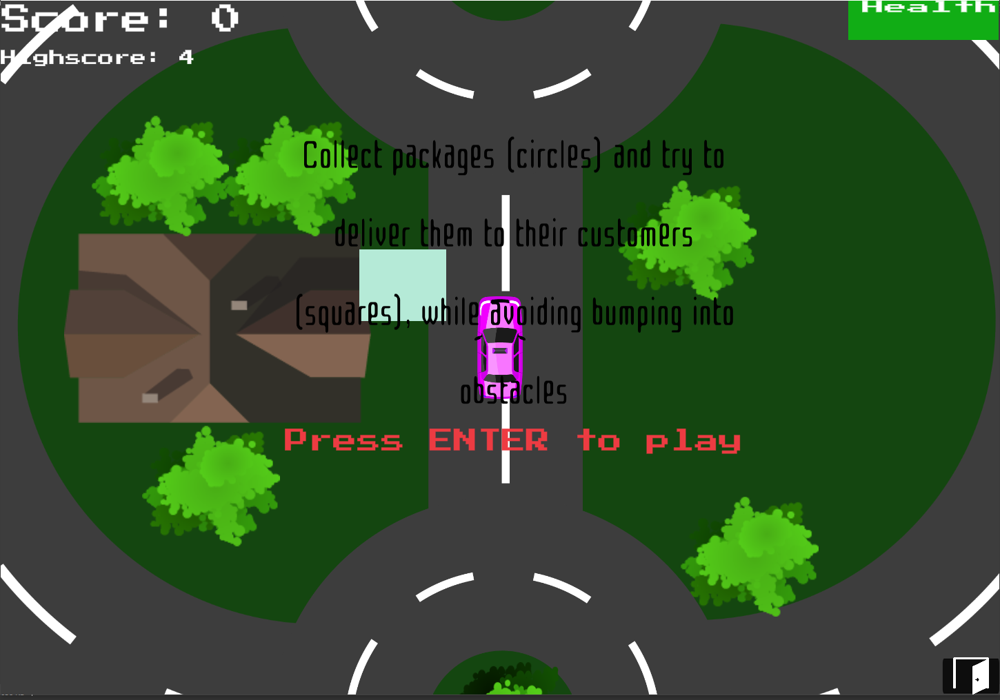
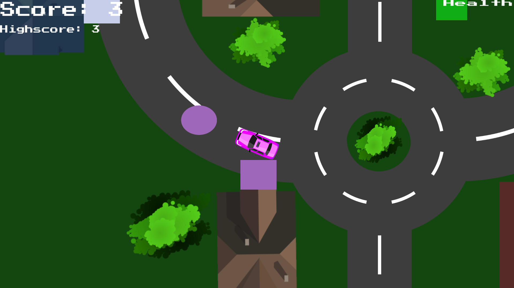

<!-- GAME PROJECT TITLE -->
# DeliveryDriver---Game
Game created for study purposes by Matheus Soares Martins, in this game you control a car tha have to deliver different packages for the customers around town. 
Packages are circles, and customers (in their houses) are squares, each of them have a different color indicating that a type of package has to be delivered to right customer.(Same color) 
While you have a package you cannot collect more packages, and each time you score a point, a random package with a random position and color spawn in the map for you to collect.
Also, if you bump into the objects in the scenario you will lose Health Points until you reach zero and the game is restarted in the pause menu showing your highscore.
 

This game was made to be played by one player, and is of moderate difficulty, and offers a relaxing experience in the gameplay with its beautiful scenario and simple mechanics.
 

Game Controls 
- Player controls: 
Up Arrow or W - Goes up in the scenario. 
Left Arrow or A - Goes left in the scenario. 
Right Arrow or D - Goes right in the scenario. 
Down Arrow or S - Goes down in the scenario. 
ENTER - Starts the game in the beggining and toggle pause/resume functions in the game. 

- Other controls: 
Esc - Closes the game. 
F11 - Toggle between fullscreen and windowed mode. 
******************************************************************************

 

<!-- GAME PROJECT IMAGES -->
# Screenshots

<!-- GAME PROJECT BUILDS -->
# Game download 
## Windows: https://mega.nz/folder/gFkE0YZB#aOPCUuKRC7QPsHWOOLmCIA
## Mac: https://mega.nz/folder/NQsR1KqJ#lyMVoklP3c-VA0PXlHxGNw
## Linux:  https://mega.nz/folder/UIFjWbwb#3Q5N5i_e_WWyuLANiob4hg